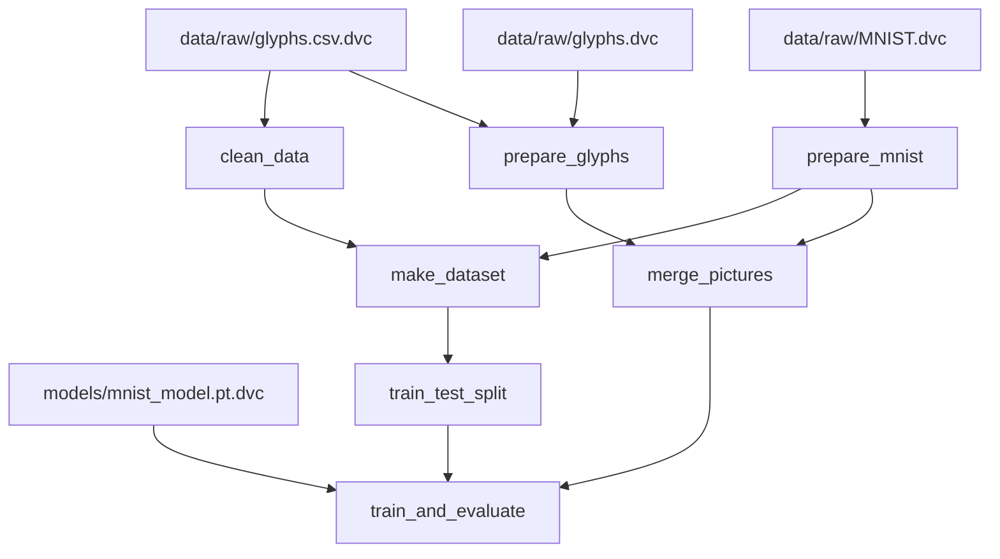

# Project overview
This is a simple pet-project to demonstrate some knowledge of Deep Learning and some MLOps practices and processes.   
The final version will be a web-site where you will be able to draw a ukrainian letter or digit and neural network will recognize it and determine whether it's lowercase or uppercase (last one is only for letters). All drawn samples will be automatically collected to improve model performance in a future.   
All data versioning, managing and preprocessing is done using DVC. I performed hyperparameter optimization with Optuna and all the experiment tracking with MLFlow.  
   
**NOTE**: I will update this README as I make progress.

# Current progress
- [x] **Data processing and DVC integration**
    - [x] Rewrite plain functions as CLI-compatible scripts
    - [x] Create remote S3 storage
    - [x] Create data pre-processing pipeline
    - [x] Add `train` and `evaluate` stages
- [x] **Model training**
    - [x] Create baseline model and pretrain it on MNIST.
    - [x] Using transfer learning fine-tune pretrained model to recognize both digits and letters as well as uppercase/lowercase classification (Multi-Output CNN).
- [ ] **Backend**
    - [x] Add hyperparameter logging and model tracking using MLFlow.
    - [ ] Create Docker Compose with Minio S3 for artifact storage, PostgreSQL for model registry, MLFlow server and backend code with FastAPI
    - [ ] Deploy Docker container to some cloud VM.
- [ ] **Frontend**
    - [ ] Create web interface (most likely with streamlit)  
    
# About
Below I will go over the various parts of the project, explaining some key points.
## Project Structure
```nohighlight
├── README.md           <- The top-level README for developers using this project.
│
├── data
│   ├── interim         <- Intermediate data that has been transformed.
│   ├── processed       <- The final, canonical data sets for modeling. 
│   └── raw             <- The original, immutable data .
│
├── Docker              <- Folder to store docker volumes, Dockerfiles and files needed to build images.
│   ├── mlflow_image
│   │   └── Dockerfile          <- Dockerfile to build image with mlflow server.
│   └── nginx.conf              <- Nginx configuration file for minio.
│
├── models              <- Trained and serialized models, hyperparameters.
│
├── notebooks           <- Jupyter notebooks.
│   ├── eda_and_viz.ipynb       <- Notebook with EDA and visualizations.
│   ├── mnist_training.ipynb    <- Notebook with training base model on MNIST data.
│   └── optuna.ipynb            <- Notebook with hyperparameter optimization using Optuna.
│
├── reports             <- Generated analysis as HTML, PDF, LaTeX, etc.
│   └── figures         <- Generated graphics and figures to be used in reporting.
│
├── src                 <- Source code for use in this project.
│   ├── backend         <- All backend related code..
│   │   └── main.py             <- Logic of a backend server.
│   ├── data            <- Scripts related to data processing or generation.
│   │   ├── clean_data.py       <- Script to drop unneeded columns.
│   │   ├── datasets.py         <- File with definitions of datasets.
│   │   ├── make_dataset.py     <- Script to generate final variant of dataset.
│   │   ├── merge_pictures.py   <- Script to merge pictures from different sources into one folder.
│   │   ├── prepare_glyphs.py   <- Script to prepare pictures of ukr. handwriting to be compatible with MNIST format.
│   │   ├── prepare_mnist.py    <- Script to decode needed amount of MNIST data into pictures.
│   │   └── split_train_test.py <- Script to perform train/test split.
│   ├── features        <- Scripts to turn raw data into features for modeling.
│   │   └── features.py         <- File with functions to generate new features.
│   ├── frontend        <- All frontend related code.
│   │   ├── Home.py             <- File with web-site main page.
│   │   └── utils.py            <- File with utility functions.
│   └── models          <- Scripts to train and evaluate models.
│       ├── functional.py       <- File with utility functions used in training and validation.
│       ├── models.py           <- File with model architecture definitions.
│       └── train_and_eval.py   <- Script to train and evaluate the model.
│
├── docker-compose.yaml <- File with definition of microservices in docker-compose.   
├── dvc.lock            <- File required for DVC data versioning.
├── dvc.yaml            <- File with definition of DVC data pre-processing pipeline.
├── poetry.lock         <- File that locks project dependencies to their current versions.
└── pyproject.toml      <- File with project settings.
```
## Data pre-processing and DVC
Original dataset was taken from [here](https://www.kaggle.com/datasets/lynnporu/rukopys). It consists of 1081 samples of Ukrainian handwritten letters, both uppercase and lowercase. You can see some examples below:    
   
The key point is that this dataset doesn't have handwritten digits included, so to fix this situation I decided to add 50 samples of each digit (from 0 to 9) to the dataset. Resulting in a following distribution of samples:    
    
Now the question arises how to correctly bring the data from different datasets to a one general form. You can find a bunch of pre-processing scripts in a corresponding `src/data` folder, but you don't need to worry about understanding and executing them correctly. I created a DVC pipeline that allows you to go from raw to ready-to-train data using only one command (I'll explain how to do it in a corresponding [section](#getting-started)).    
Our pipeline looks like this:    

Let me break it down for you. As you can see first three steps are executed in parallel:
1. **Clean data** - takes raw .csv file with ukrainian handwriting as an input and filters out all unnecessary information for our task.
2. **Prepare glyphs** - takes folder containing raw images of ukrainian handwriting as an input and converts them to MNIST format (inverted 28x28 images).
3. **Prepare MNIST** - takes folder containing raw byte-encoded MNIST images and produces equal amount of .png images per class, as well as .csv file with metadata about these pictures (label, filename, etc.)
4. **Make dataset** - takes cleaned .csv file from stage(1) and .csv file with MNIST metadata from stage(3) and joins them resulting in a final dataset.
5. **Merge pictures** - takes folder with processed images from stages(2) and (3) and merges them into one directory.
6. **Train/test split** - splits .csv file from stage(4) into train and test subsets.
7. **Train and evaluate** - fine-tunes model pre-trained on MNIST on a training data from stages (5) and (6) and evaluates its performance on test data also from stage(6).

That's it, even if it looks a little difficult, in fact, all the stages are quite simple. Take a look at how our final images look like after all the processing (without augmentations ofcourse):    
   
## Model training
As I've mentioned earlier, actually I've used 2 models to solve my problem. As you can see on the plots above, amount of available data is very little. 1k of unequally distributed samples (33 classes and some of them don't have uppercase analogs at all) doesn't allow us to generalize well. And even if we could, we wouldn't be able to recognize the numbers at all. So, my solution was pretty straightforward, pretrain the model on MNIST first (because letter images are pretty much the same) and then fine-tune it to solve multi-output classification problem.
### MNIST Model
MNIST classification problem was solved long time ago, so I have nothing special to say here. With pretty much default hyperparameters I was able to reach `accuracy = 99.39%` only after 25 epochs of training. More than enough for our task. You can see the nn's architecture below:   

### Multi-output CNN
Here, I slightly modified the architecture above. Let's see how it looks now:  

As you can see, I've replaced one classification head with two FCN layers. First has 43 outputs (33 ukrainian letters and 10 digits) and the second one has only 1 output to predict whether sample is uppercase and lowercase.   
A few words about loss functions, after experimenting with different weighting strategies, to give more weight to a label classification task, I've discovered that one can achieve the most stable training process just summing up to loss functions. Thus, the final loss looked like this: $L = CE + BCE$.    
All the hyperparameters where fine-tuned with [`optuna`](https://github.com/optuna/optuna) framework, you can check out this code at `notebooks/optuna.ipynb`.
## Final Evaluation Results
After training the model above for 30 epochs, I was able to achieve this results on test dataset of 300 samples:
- `Label classification accuracy = 93.3%`
- `Is uppercase classification accuracy = 92.3%`

Also, I've prepared confusion matrices to visualize model predictions:


    
    
I would not call the obtained results ideal, yes, there is room for improvement (that's why I'm collecting samples drawn by user actually), but still, I'm satisfied with the obtained metric values.
We have a very lightweight model, trained for only 15 epochs. On my laptop GPU training lasts for a minute at its best. It generalizes pretty good on both tasks simultaneously. On the first confusion matrix you can see that model sometimes confuses such ukrainian letters as `г` and `ґ`, `е`, `є` and `с`.    
At the same time, we did pretty good on lowercase/uppercase classification too. On the corresponding confusion matrix you can see than we have only `3` false positives and `20` false negatives. And this is without knowing uppercase variants for 17 letters at all!    
To sum up, this results look quite good, taking to account all constraints I have. Metrics values can be improvement in a future probably by adding more data.
